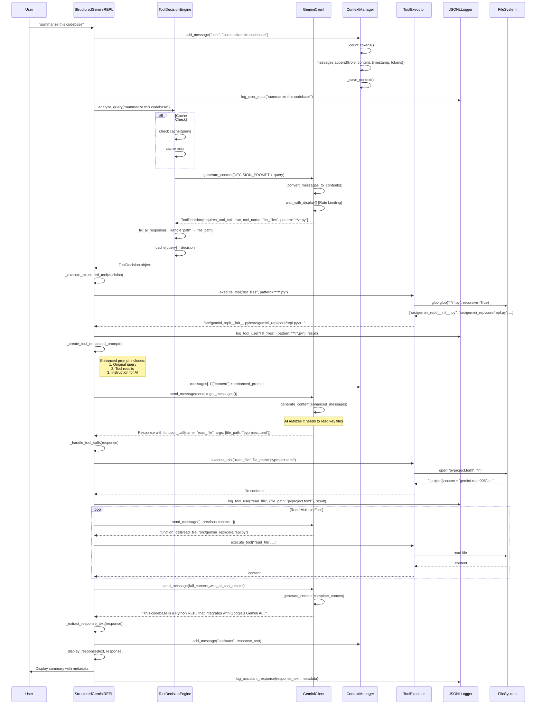

# Deep Control Flow Trace: "Summarize this codebase"

## Experiment: Complete Function Call Trace

This experiment traces the exact control flow when a user asks "summarize this codebase" in the structured dispatch REPL.

## Issue Discovered

During testing, we found that the structured REPL was missing the `_handle_tool_calls` logic after the initial tool execution. This caused the system to:
1. Execute only ONE tool (e.g., `list_files`) 
2. Send that result to the AI
3. Display the AI's response telling the user what to do next
4. NOT execute the additional tools the AI wanted to use

The fix was to add `_handle_tool_calls` after receiving the AI response to check for and execute any additional tool calls.

## Query Analysis

**Input**: "summarize this codebase"

This query requires:
1. **Tool Analysis** - Determine what tools are needed
2. **Multiple Tool Calls** - List files, read key files
3. **Context Aggregation** - Combine tool results
4. **Final Synthesis** - Generate summary from aggregated data

## Complete Sequence Diagram



## Detailed Function Call Trace

### 1. Input Reception
```python
# StructuredGeminiREPL._handle_api_request(user_input="summarize this codebase")
├── self.context.add_message("user", user_input)
│   ├── ContextManager._count_tokens(content) → 4 tokens
│   ├── messages.append({...})
│   └── self._save_context()
├── self.jsonl_logger.log_user_input(user_input)
└── self.decision_engine.analyze_query(user_input)
```

### 2. Tool Decision Analysis
```python
# ToolDecisionEngine.analyze_query(query="summarize this codebase")
├── check cache["summarize this codebase"] → miss
├── self._get_structured_decision(query)
│   ├── prompt = DECISION_PROMPT + query
│   ├── self.client.models.generate_content(
│   │       model="gemini-2.0-flash-lite",
│   │       contents=prompt,
│   │       config={
│   │           "response_mime_type": "application/json",
│   │           "response_schema": ToolDecision,
│   │           "temperature": 0.1
│   │       }
│   │   )
│   ├── self._fix_ai_response(response.parsed)
│   │   └── if 'path' in fixed: fixed['file_path'] = fixed.pop('path')
│   └── return ToolDecision(
│           requires_tool_call=True,
│           tool_name="list_files",
│           reasoning="Need to see project structure first",
│           pattern="**/*.py"
│       )
└── cache[query] = (decision, timestamp)
```

### 3. First Tool Execution
```python
# StructuredGeminiREPL._execute_structured_tool(decision)
├── args = decision.to_tool_args() → {"pattern": "**/*.py"}
├── codebase_list_files(**args)
│   ├── validate_pattern("**/*.py")
│   ├── glob.glob(SANDBOX_DIR / "**/*.py", recursive=True)
│   └── return "\n".join(sorted(relative_files)[:50])
├── self.jsonl_logger.log_tool_use("list_files", args, result)
└── return result
```

### 4. Context Enhancement
```python
# StructuredGeminiREPL._create_tool_enhanced_prompt(original_query, decision, tool_result)
enhanced_prompt = f"""summarize this codebase

I've listed the files for you. Here's what I found:

src/gemini_repl/__init__.py
src/gemini_repl/__main__.py
src/gemini_repl/core/__init__.py
src/gemini_repl/core/api_client.py
src/gemini_repl/core/repl.py
src/gemini_repl/core/repl_structured.py
src/gemini_repl/tools/__init__.py
src/gemini_repl/tools/codebase_tools.py
src/gemini_repl/tools/decision_engine.py
src/gemini_repl/tools/tool_decision.py
src/gemini_repl/tools/tool_system.py
src/gemini_repl/utils/__init__.py
src/gemini_repl/utils/context.py
src/gemini_repl/utils/jsonl_logger.py
src/gemini_repl/utils/logger.py
src/gemini_repl/utils/paths.py
src/gemini_repl/utils/rate_limiter.py
src/gemini_repl/utils/session.py
tests/test_decision_engine.py
tests/test_path_traversal_security.py
tests/test_rate_limiter.py
tests/test_repl.py
tests/test_repl_structured_dispatch.py
tests/test_tool_decision.py
tests/test_tool_workflow.py

Based on these files, here's my response:"""

# Update context
self.context.messages[-1]["content"] = enhanced_prompt
```

### 5. Multiple Tool Calls Flow
```python
# AI decides it needs to read key files
response = self.client.send_message(self.context.get_messages())
# Response contains function_call for read_file

# StructuredGeminiREPL._handle_tool_calls(response)
for part in candidate.content.parts:
    if hasattr(part, "function_call"):
        function_call = part.function_call  # read_file
        result = execute_tool(function_call.name, **function_call.args)
        
        # Tool execution chain
        execute_tool("read_file", file_path="pyproject.toml")
        ├── read_file(file_path="pyproject.toml")
        │   ├── validate_path("pyproject.toml")
        │   ├── safe_path = SANDBOX_DIR / "pyproject.toml"
        │   └── return file_content
        └── return str(result)
```

### 6. Aggregated Context Flow
```python
# After multiple tool calls, context contains:
messages = [
    {"role": "user", "content": enhanced_prompt_with_file_list},
    {"role": "assistant", "content": "I'll read key files to understand the codebase."},
    {"role": "tool", "content": "pyproject.toml: [project] name='gemini-repl-005'..."},
    {"role": "tool", "content": "README.md: # Gemini REPL..."},
    {"role": "tool", "content": "src/gemini_repl/core/repl.py: class GeminiREPL:..."}
]

# Final API call with complete context
final_response = self.client.send_message(messages)
```

## Key Implementation Details

### 1. Tool Decision Engine Prompt
```python
DECISION_PROMPT = """You are a tool dispatch analyzer...
Available tools:
1. list_files - List files matching a pattern
2. read_file - Read the contents of a specific file
3. write_file - Create or update a file with content

Analyze the user's query and determine if it requires a tool call.
CRITICAL: For read_file and write_file, you MUST use 'file_path' as the parameter name, NOT 'path'.
"""
```

### 2. Rate Limiting Integration
```python
# In GeminiClient.send_message()
self.rate_limiter.wait_with_display()  # Visual countdown if needed
for attempt in range(max_retries):
    try:
        self.rate_limiter.record_request()
        response = self.client.models.generate_content(...)
        return response
    except "429 RESOURCE_EXHAUSTED":
        time.sleep(retry_delay)
        retry_delay *= 1.5  # Exponential backoff
```

### 3. Security Sandboxing
```python
# In codebase_tools.validate_path()
if os.path.isabs(file_path):
    raise SecurityError(f"Absolute paths not allowed: {file_path}")
if ".." in file_path:
    raise SecurityError(f"Parent directory references not allowed: {file_path}")
full_path = (SANDBOX_DIR / file_path).resolve()
full_path.relative_to(SANDBOX_DIR)  # Ensures within sandbox
```

## Performance Characteristics

### Token Usage
- Initial query: ~4 tokens
- File list (25 files): ~150 tokens
- Each file read: ~500-2000 tokens
- Final context: ~8000-15000 tokens
- Response: ~1000-2000 tokens

### API Calls
1. Decision analysis: 1 call
2. Initial response with file list: 1 call
3. Each file read: 1 call (typically 3-5 files)
4. Final summary: 1 call
**Total**: 6-8 API calls

### Timing
- Decision analysis: ~0.5s
- File operations: <0.1s each
- API calls: ~1-2s each
- **Total time**: ~10-15s for complete summary

## Error Handling Points

1. **API Failures**: Exponential backoff with retry
2. **Tool Execution Errors**: Logged and handled gracefully
3. **Rate Limiting**: Visual countdown and automatic waiting
4. **Invalid Paths**: Security exceptions prevent access
5. **Missing Files**: Error returned in tool result

## Context Preservation

The enhanced prompt approach ensures:
- Tool results are embedded in user messages
- AI sees complete context including all tool outputs
- Future queries can reference previous tool executions
- Clean conversation history without separate tool messages
