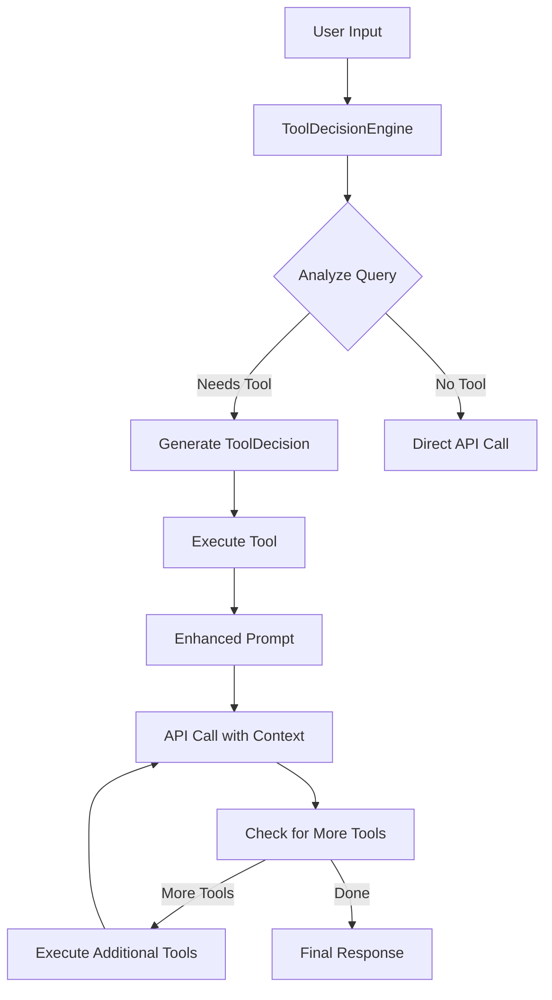
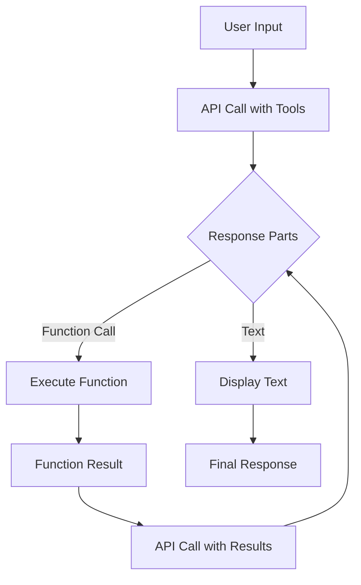

# Function Calling Architecture Comparison

## Current Implementation (Complex Dispatch)



### Components:
1. **ToolDecisionEngine** - Analyzes queries to determine tool needs
2. **ToolDecision Model** - Structured data for tool execution
3. **Enhanced Prompts** - Tool results embedded in user messages
4. **Multiple API Calls** - Separate calls for decision and execution

### Pros:
- Explicit control over tool decisions
- Can debug decision-making process
- Structured approach with clear phases

### Cons:
- Complex implementation
- Multiple API calls increase latency
- Decision engine needs careful prompt engineering
- Can fail to chain tools properly (Bug #28)

## Simplified Implementation (Direct Function Calling)



### Components:
1. **Direct API Call** - Single call with tool declarations
2. **Response Parts** - Native handling of text and function calls
3. **Automatic Chaining** - API handles tool sequencing

### Pros:
- Follows Google's recommended pattern
- Simpler code, easier to maintain
- Native tool chaining support
- Single decision point (in the model)
- Better integration with API features

### Cons:
- Less visibility into decision process
- Relies heavily on system prompt
- Harder to debug why tools were/weren't used

## Key Differences

| Aspect | Current (Dispatch) | Simplified |
|--------|-------------------|------------|
| Decision Making | Separate ToolDecisionEngine | Model decides natively |
| API Calls | Multiple (decision + execution) | Single with embedded tools |
| Tool Chaining | Manual implementation | Automatic via API |
| Code Complexity | High | Low |
| Debugging | Explicit decision visibility | Black box decision |
| Prompt Engineering | Complex decision prompts | System prompt only |

## Implementation Example

### Current Approach:
```python
# 1. Analyze query
decision = self.decision_engine.analyze_query(user_input)

# 2. Execute tool if needed
if decision.requires_tool_call:
    result = self._execute_structured_tool(decision)
    enhanced_prompt = self._create_tool_enhanced_prompt(...)
    
# 3. Call API with enhanced context
response = self.client.send_message(messages)

# 4. Check for more tools
final_response = self._handle_tool_calls(response, user_input)
```

### Simplified Approach:
```python
# 1. Single API call with tools
response = self.client.models.generate_content(
    contents=messages,
    config=GenerateContentConfig(tools=[tools])
)

# 2. Process response parts
for part in response.candidates[0].content.parts:
    if part.function_call:
        result = execute_function(part.function_call)
        # API handles chaining automatically
```

## Recommendation

The simplified approach is recommended because:

1. **It's the official pattern** - Google's documentation recommends this
2. **Less code to maintain** - Fewer components, less complexity
3. **Better tool chaining** - Native support vs manual implementation
4. **Single source of truth** - System prompt drives behavior
5. **Future proof** - Aligned with API evolution

The current dispatch system adds complexity without clear benefits and introduces bugs like #28 (tool chaining) and #29 (advisory behavior instead of tool use).
